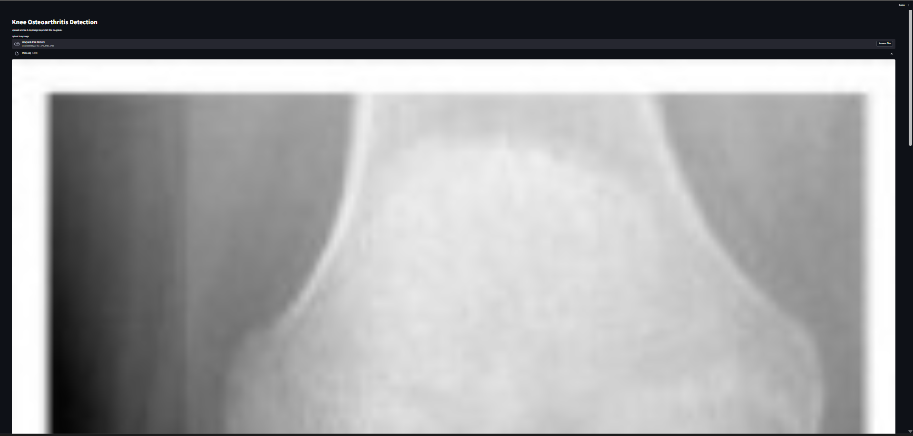
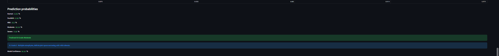
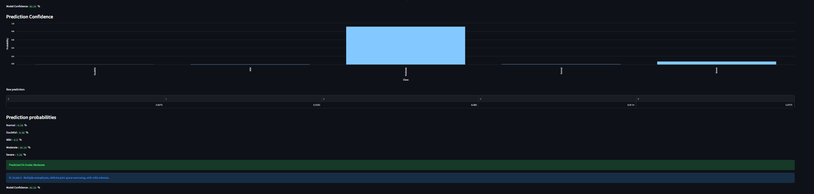
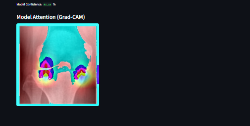

# 🦵 Knee Osteoarthritis Detection using Deep Learning (KL-Grade I–IV)

A complete Medical Imaging & Deep Learning Project developed using Python, TensorFlow/Keras, CNN architectures, and Streamlit to automatically detect and classify Knee Osteoarthritis (OA) severity from knee X-ray images based on the Kellgren–Lawrence (KL) grading scale.

The system analyzes knee X-rays and predicts the severity stage of osteoarthritis while also providing prediction confidence, class probability distribution, and Grad-CAM heatmap visualizations for interpretability and clinical support.

---

## 📌 Project Overview

Knee Osteoarthritis (OA) is one of the most common degenerative joint diseases, causing pain, stiffness, and reduced mobility in millions of people worldwide. Manual interpretation of knee X-rays can be time-consuming, subjective, and inconsistent, especially when detecting early-stage OA.

This project addresses that challenge by developing an automated deep learning–based diagnostic support system capable of classifying OA severity using knee X-ray images. The system uses Convolutional Neural Networks (CNNs) to learn clinically relevant patterns such as joint space narrowing, osteophyte formation, and bone deformities, enabling accurate KL-grade classification.

---

## 🎯 Key Objectives

* Detect Knee Osteoarthritis from X-ray images
* Classify OA severity using the KL grading system
* Reduce dependency on manual radiological interpretation
* Provide fast and consistent predictions
* Improve diagnostic transparency using Grad-CAM heatmaps
* Deploy an interactive Streamlit web application for real-time prediction

---

## 📂 Project Structure

```text
knee-osteoarthritis-detection-kl-grade-classification/
│
├── app.py
├── Knee_Osteoarthritis.ipynb
├── requirements.txt
├── README.md
├── docs/
│   ├── Knee_Osteoarthritis_Report.pdf
│   └── Knee_Osteoarthritis_ppt.pdf
├── screenshots/
│   ├── streamlit_home.png
│   ├── prediction_result.png
│   ├── probability_distribution.png
│   └── gradcam_heatmap.png
└── model/
    └── best_knee_oa_model.h5   (download separately)
```

---

## 🏥 Problem Statement

Traditional OA diagnosis relies heavily on radiologists and orthopedic specialists who visually inspect knee X-rays and assign a KL grade based on features such as joint space narrowing, osteophyte formation, and bone sclerosis.

### Limitations of the Existing System

* Subjective and dependent on expert experience
* Time-consuming for large patient volumes
* Difficult for detecting subtle early-stage OA changes
* Challenging in healthcare environments with limited specialists
* Increased workload for radiologists and orthopedic professionals

The proposed solution aims to provide an intelligent automated system that improves diagnostic accuracy and reduces analysis time.

---

## 💡 Proposed System

The project introduces a CNN-based automated classification system that:

* Accepts knee X-ray images as input
* Performs preprocessing and normalization
* Uses deep learning models such as ResNet / EfficientNet for feature extraction and classification
* Predicts the KL grade of osteoarthritis
* Displays prediction confidence and probability distribution
* Generates Grad-CAM heatmaps highlighting the regions influencing the model’s decision
* Provides an easy-to-use Streamlit web interface for real-time interaction

---

## 📊 KL Grading Classification

The system classifies knee X-rays into the following severity levels:

| KL Grade | Severity |
| -------- | -------- |
|   KL0    | Normal   |
|   KL1    | Doubtful |
|   KL2    | Mild     |
|   KL3    | Moderate |
|   KL4    | Severe   |

These labels follow the Kellgren–Lawrence grading system used in the dataset.

---

## 🧠 System Architecture

```text
Knee X-ray Image
        ↓
Image Preprocessing
        ↓
CNN Feature Extraction
        ↓
KL Grade Classification
        ↓
Probability Distribution
        ↓
Grad-CAM Explainability
        ↓
Streamlit Web Interface
        ↓
Final Prediction Output
```

---

## 🧹 Data Preprocessing Pipeline

The preprocessing module performs:

* Image resizing (224 × 224)
* Pixel normalization
* Noise reduction
* Contrast enhancement
* Data augmentation (rotation, zoom, flip, shift)
* Label encoding and dataset organization

These steps improve image quality, reduce overfitting, and help the model learn clinically relevant features effectively.

---

## ⚖️ Dataset Balancing

To handle class imbalance across KL grades, the project incorporates balancing strategies such as:

* Oversampling
* Undersampling
* Weighted loss functions
* Balanced batch sampling approaches

This ensures fair learning across all osteoarthritis severity classes.

---

## 📊 Dataset Description

The dataset consists of labeled knee X-ray images categorized according to the Kellgren–Lawrence grading system.

### Dataset Features

* Image Type: Knee X-ray Images
* Classes: Normal, Doubtful, Mild, Moderate, Severe
* Data Split: Training, Validation, Testing
* Preprocessing: Resizing, normalization, augmentation

The dataset provides sufficient variability in knee joint conditions, helping the deep learning model learn meaningful patterns for accurate OA severity classification.

---

## 🤖 Deep Learning Models Used

The notebook supports architectures such as:

* ResNet50
* EfficientNetB0
* Custom CNN architectures

### Training Pipeline

* Transfer learning with ImageNet weights
* Fine-tuning of deeper layers
* Hyperparameter optimization
* Early stopping and model checkpointing
* Best model selection based on validation accuracy

---

## 📈 Model Evaluation

The evaluation module measures classification performance using:

* Accuracy
* Precision
* Recall
* F1-Score
* Confusion Matrix
* Class Probability Distribution

These metrics help assess the effectiveness of KL-grade classification.

---

## 🔥 Grad-CAM Explainability

To improve clinical interpretability, the system generates Grad-CAM heatmaps that highlight the regions of the knee X-ray that contributed most to the model’s prediction.

### Heatmap Highlights

* Joint space narrowing
* Osteophyte regions
* Bone deformities
* Sclerotic changes

This helps medical professionals verify whether the model is focusing on clinically relevant anatomical structures rather than irrelevant image regions.

---

## 🖥️ Streamlit Web Application

The project includes a user-friendly Streamlit interface that enables real-time prediction from external knee X-ray images.

### Features

* 📤 Upload knee X-ray images
* 🦵 Predict KL grade automatically
* 📊 Display confidence scores
* 📈 Show probability distribution
* 🔥 Generate Grad-CAM heatmaps
* 🌐 Browser-based interactive interface

### Example Output

The application displays:

* Predicted OA Grade: Moderate
* KL Grade 3: Multiple osteophytes, definite joint space narrowing, with mild sclerosis
* Model Confidence: 38.71%
* Probability Distribution: Normal, Doubtful, Mild, Moderate, Severe
* Grad-CAM Visualization: Highlights the knee regions influencing the prediction

---

## 🛠️ Technologies Used

### Programming Language

* Python 3.8 / 3.9 / 3.10

### Development Environment

* Jupyter Notebook
* Google Colab
* Kaggle Notebook
* VS Code

### Deep Learning Frameworks

* TensorFlow 2.x
* Keras
* PyTorch

### Machine Learning Libraries

* Scikit-learn
* Imbalanced-learn

### Image Processing Libraries

* OpenCV
* Pillow (PIL)
* Albumentations

### Data Handling

* NumPy
* Pandas

### Visualization

* Matplotlib
* Seaborn
* Grad-CAM / tf-keras-vis

### Web Framework

* Streamlit

---

## 📥 Full Project Download

## 🚀 How to Run the Project

### 1️⃣ Clone or Download the Repository

Download this repository from GitHub.

### 2️⃣ Install Required Libraries

```bash
pip install -r requirements.txt
```

Or install manually:

```bash
pip install streamlit tensorflow numpy opencv-python pillow matplotlib seaborn scikit-learn albumentations tf-keras-vis imbalanced-learn
```

### 3️⃣ Download the Trained Model

The trained model files are too large to be stored directly in this repository.

🔗 Google Drive:
https://drive.google.com/file/d/1Q1kqwQZDgbyGVe2dFVz7yZkaIfRigjuc/view?usp=drive_link


### 4️⃣ Run the Training Notebook (Optional)

```bash
jupyter notebook Knee_Osteoarthritis.ipynb
```

### 5️⃣ Launch the Streamlit Application

```bash
streamlit run app.py
```

### 6️⃣ Open in Browser

```text
http://localhost:8501
```

Upload a knee X-ray image to receive the predicted KL grade, confidence score, probability distribution, and Grad-CAM visualization.

---

## 📷 Application Preview

### 🏠 Streamlit Interface




### 📊 Prediction Result



### 📈 Probability Distribution



### 🔥 Grad-CAM Heatmap



---

## 📊 Key Insights

* Deep learning models can reliably identify joint space narrowing and bone deformities from X-ray images.
* Automated analysis reduces the workload on radiologists and improves diagnostic consistency.
* Grad-CAM visualizations increase trust and transparency in AI-based medical predictions.
* The system demonstrates strong potential for early OA detection and clinical decision support.

---

## 🧪 System Testing

The project includes multiple testing strategies:

* Functional Testing – Verifies prediction workflow
* Usability Testing – Ensures easy interaction with the Streamlit app
* Performance Testing – Measures image processing and prediction efficiency
* Compatibility Testing – Validates operation across browsers and operating systems
* Regression Testing – Ensures updates do not break existing functionality

---

## 📚 Learning Outcomes

This project helped develop expertise in:

* Medical image preprocessing
* Convolutional Neural Networks (CNNs)
* Transfer learning and fine-tuning
* Imbalanced dataset handling
* Model evaluation for healthcare AI
* Explainable AI using Grad-CAM
* Streamlit deployment for medical applications
* End-to-end deep learning workflow design

---

## 👤 Submitted by:

V. Madhubala

---

## 📄 Documentation Included

This repository contains:

* 📘 Knee_Osteoarthritis_Report.pdf – Complete project report
* 📊 Knee_Osteoarthritis_ppt.pdf – Final review presentation
* 💻 Knee_Osteoarthritis.ipynb – Model training and evaluation notebook
* 🌐 app.py – Streamlit deployment application
* 🖼️ Screenshots & Outputs – Interface and prediction examples
* 📃 Knee_Osteoarthritis_Detection.pdf - Full Interface Output

---

## 📬 Connect with Me

* LinkedIn: https://www.linkedin.com/in/v-madhubala-764747286
* GitHub: https://github.com/Madhubala69
* Portfolio: https://madhubala69.github.io/Madhubala.github.io/

---

## ⭐ Project Status

✅ Completed

---

## 🌟 Final Note

This project demonstrates how Deep Learning, Medical Image Processing, Explainable AI, and Streamlit-based deployment can be combined into a practical clinical decision-support system for automated Knee Osteoarthritis detection and KL-grade classification.

By providing fast, reliable, and interpretable predictions, the system has the potential to assist healthcare professionals in early diagnosis, severity assessment, and improved patient care.

---

Note: This is a research project. Always consult a medical professional for accurate diagnosis.

---
